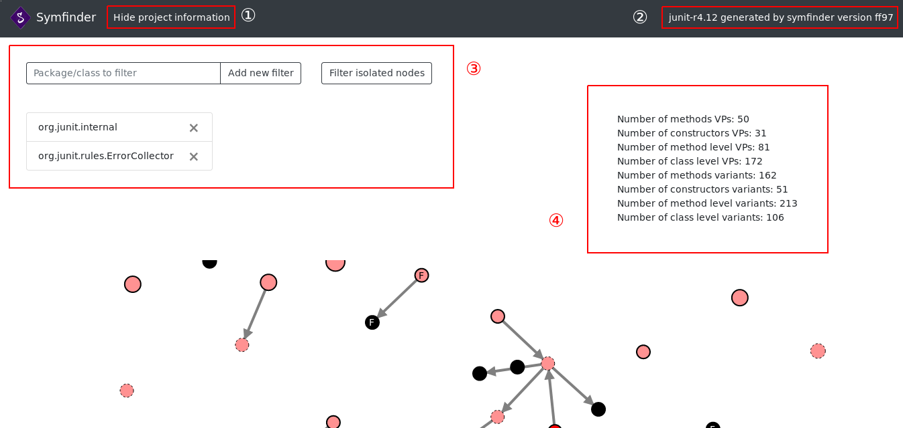

# symfinder

[](https://travis-ci.com/DeathStar3/symfinder)

## Technical Requirements

- Docker
    - Instructions to install Docker are available [here](https://docs.docker.com/install/#supported-platforms).
- Docker Compose
    - Instructions to install Docker Compose are available [here](https://docs.docker.com/compose/install/#install-compose).

**Note:** You need to have a system running on either 
- GNU/Linux
- Windows 10 64bit: Pro, Enterprise or Education (Build 15063 or later)
- macOS Sierra 10.12 or newer on a hardware from at least 2010

**Note:** If you run symfinder on a Windows system, symfinder must be placed somewhere on your `C:` drive.

If your system does not match any of the requirements above, you must install a virtual machine.
[This tutorial](https://www.wikihow.com/Install-Ubuntu-on-VirtualBox) may help you.

**Note:** By default, on a GNU/Linux host, Docker commands must be run using `sudo`. Two options are available for you in order to run symfinder:
- Follow [these short steps](https://docs.docker.com/install/linux/linux-postinstall/#manage-docker-as-a-non-root-user) to allow your user to call Docker commands,
- Preface the scripts calls with `sudo`.

## Getting symfinder

1. Open a terminal and clone the repository by running:

    ```bash
    git clone https://github.com/DeathStar3/symfinder
    ```

2. Move in the project directory

    ```bash
    cd symfinder
    ```


## Reproducing the experiments

Run the analyses by running


- On GNU/Linux and macOS

    ```bash
    ./run.sh
    ```

- On Windows

    ```batch
    run.bat
    ```

This command will analyse the following projects:
- [Java AWT 8u202-b1532](https://github.com/JetBrains/jdk8u_jdk/tree/jb8u202-b1532/src/share/classes/java/awt)
- [Apache CXF 3.2.7](https://github.com/apache/cxf/tree/cxf-3.2.7/core/src/main/java/org/apache/cxf)
- [JUnit 4.12](https://github.com/junit-team/junit4/tree/r4.12/src/main/java)
- [Apache Maven 3.6.0](https://github.com/apache/maven/tree/maven-3.6.0)
- [JHipster 2.0.28](https://github.com/jhipster/jhipster/tree/2.0.28/jhipster-framework/src/main/java)
- [JFreeChart 1.5.0](https://github.com/jfree/jfreechart/tree/v1.5.0/src/main/java/org/jfree)
- [JavaGeom](https://github.com/dlegland/javaGeom/tree/7e5ee60ea9febe2acbadb75557d9659d7fafdd28/src)
- [ArgoUML](https://github.com/marcusvnac/argouml-spl/tree/bcae37308b13b7ee62da0867a77d21a0141a0f18/src)

You can specify the projects you want to run by passing their names as parameters of the running script, for example

```bash
./run.sh junit
```

More details about the analysed projects and their definition are given in the [Using symfinder on your project](#using-symfinder-on-your-project) section.

### Analysing the output data


Once the analyses are finished, run

- On GNU/Linux and macOS    

```bash
./visualization.sh
```

- On Windows

```bash
visualization.bat
```
Then, in your web browser, go to `http://localhost:8181`.
An index page will appear with the list of the analysed projects.
Click on the desired project to view its visualization.

Here is an example of visualization window:



The window is made of several parts:

- ①: The top bar contains four buttons:
	- By clicking on the `Hide project information` button, you can hide the parts ③ and ④ in order to be able to see the graph better.
	- The `Color packages` button display a tab similar to the part ③ where you can enter the name of a package or a class and a new color will be applied to the corresponding nodes.
	- The `Show legend` button displays a legend to help you read the visualization.
	- The `Display variants` button displays all the variants of variation points, including the ones not being variation points. Click again on the button to show only variation points.
- ②: Here you can see the name and tag/commit ID of the project corresponding to the visualization being viewed, as well as the commit corresponding to the version of symfinder that generated the visualization.
- ③: In the `Package/class to filter` field, you can enter the name of a class or package that you want to filter on the visualization.
When a filter is added, it is added to the list below. The cross on the right of each filter allows you to remove it.
On the right of this field is a `Filter isolated nodes` button which, when activated, removes the nodes having no relationship from the visualization.
Click again on the button to unfilter them.
- ④: Displays metrics on the project concerning variation points and variants.

## Using symfinder on your project

### symfinder configuration

The application's settings are set up using a YAML file, called `symfinder.yaml`, that must be at the root of the project.
Here is an example:

```yaml
neo4j:
  boltAddress: bolt://localhost:7687
  user: neo4j
  password: root

experiments_file: experiments.yaml
```

#### Neo4j parameters

- `boltAddress`: address where Neo4j's bolt driver is exposed
- `user`: username
- `password`: the password to access the database

#### Experiments

`experiments_file` corresponds to the path of a YAML file (relative to the `experiments` directory) containing the description of the different source codes you want to analyse. Here is an example:

```yaml
junit:
  repositoryUrl: https://github.com/junit-team/junit4
  sourcePackage: .
  tagIds:
    - r4.12
javaGeom:
  repositoryUrl: https://github.com/dlegland/javaGeom
  sourcePackage: src
  commitIds:
    - 7e5ee60ea9febe2acbadb75557d9659d7fafdd28
```


You can specify as many experiments as you want.
Each project is defined by different parameters:
- `repositoryUrl`: URL of the project's Git repository
- `sourcePackage`: relative path of the package containing the sources of the project to analyse. `.` corresponds to the root of the project to be analysed.
- `commitIds`: IDs of the commits to analyse
- `tagsIds`: IDs of the tags to analyse

For each experiment, you can mix different commits and different tags to checkout. For example, we could have :

```yaml
junit:
  repositoryUrl: https://github.com/junit-team/junit4
  sourcePackage: .
  tagIds:
    - r4.12
    - r4.11
  commitIds:
    - c3715204786394f461d94953de9a66a4cec684e9
```

## Building symfinder

**This step is only needed if you edited symfinder's source code.**

You can build symfinder's Docker images by running

```bash
./build.sh
```

Then, run symfinder using the local images that you just built.

```bash
./run.sh --local
```
